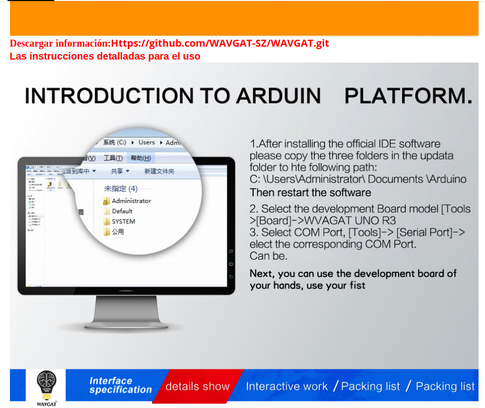

# ¿Cómo instalar software para controlar mi Arduino? 

## Arduino IDE

- [Enlace para descarga](https://www.arduino.cc/en/Main/Software).

- Cuando estés en el programa (Arduino IDE) asegúrate de seleccionar la **placa** ( Herramientas>Placa>ArduinoUno) y el **puerto** de salida ( Herramientas>Puerto>_selecciona uno hasta que funcione_).

- Si tienes problemas hay muchos tutoriales y videotutoriales por Internet.

## ArduinoBlock

- ArduinoBlock te permite programar en bloques en la [siguiente web](http://www.arduinoblocks.com/). Para poder cargar el programa en tu Arduino tienes que instalar ArduinoBlocks-Connector (conecta ArduinoBlock con tu Arduino).

- [Enlace para descargar ArduinoBlocks-Connector](http://www.arduinoblocks.com/web/site/abconnector)).

## Arduinodroid en móviles

- [Enlace para descarga](https://play.google.com/store/apps/details?id=name.antonsmirnov.android.arduinodroid2&hl=es&gl=US).

- Se necesita un cable USB OTG. Se tiene que habilitar las **opciones del desarrollador** y activar **USB-OTG**.

- Si tienes problemas hay muchos tutoriales y videotutoriales por Internet.

# Excepciones con placa WAVGAT

Para usar la placa de Arduino Uno WAVGAT seguir las instrucciones siguientes:

Las carpetas necesarias que se indican en las instrucciones están en el archivo de este repositorio [update.zip](update.zip)