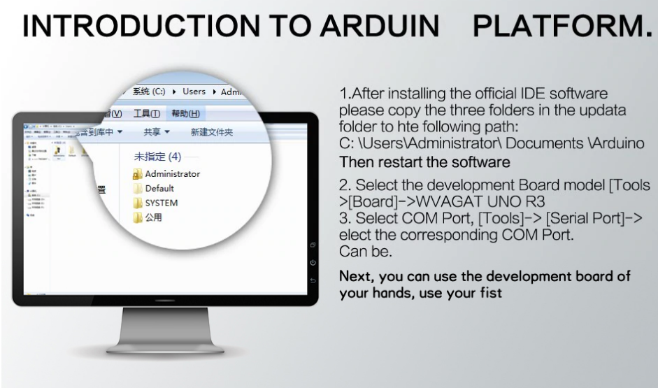

# ¿Cómo instalar software para controlar mi Arduino? 

## Arduino IDE

- [Enlace para descarga](https://www.arduino.cc/en/Main/Software).

- Enlace de ayuda para instalarlo:

    https://www.youtube.com/watch?v=WqjT_YpwGRI

- Cuando estés en el programa (Arduino IDE) asegúrate de seleccionar la **placa** ( Herramientas>Placa>ArduinoUno) y el **puerto** de salida ( Herramientas>Puerto>_selecciona uno hasta que funcione_).

- Si tienes problemas hay muchos tutoriales y videotutoriales por Internet.

- Para la placa WAVGAT tienes que agregar las carpetas indicadas en el apartado "Excepciones con placa WAVGAT".

## ArduinoBlock

- ArduinoBlock te permite programar en bloques en la [siguiente web](http://www.arduinoblocks.com/). Para poder cargar el programa en tu Arduino tienes que instalar ArduinoBlocks-Connector (conecta ArduinoBlock con tu Arduino).

- [Enlace para descargar ArduinoBlocks-Connector](http://www.arduinoblocks.com/web/site/abconnector).

## Arduinodroid en móviles

- [Enlace para descarga](https://play.google.com/store/apps/details?id=name.antonsmirnov.android.arduinodroid2&hl=es&gl=US).

- Se necesita un cable USB OTG. Se tiene que habilitar las **opciones del desarrollador** y activar **USB-OTG**.

- Si tienes problemas hay muchos tutoriales y videotutoriales por Internet.

# Excepciones con placa WAVGAT

## ¿Qué es?

La placa WAVGAT-UNO-R3 es una placa análoga a Arduino UNO pero con un coste mucho menor. Interacciona con el entorno Arduino IDE al igual que la placa original conviendose en una opción barata para aprender a programar un Arduino.

## Configuración
Las placas WAVGAT contienen el chip barato CH430 que sustituye a otros originales de Arduino UNO. Esto implica la **necesidad de configurar la placa WAVGAT para que sea reconocida por software Arduino IDE**. Los pasos a seguir para reconocer la placa son los siguientes:

1. Instalación de Arduino IDE;

2. Instalar drivers para el chip CH340;
Los archivos necesarios están distribuidos en tres carpetas. Éstas se pueden encontrar dentro de un zip en este repositorio. [update.zip](update.zip) 
* Windows
    * Copia las tres carpetas (hardware, libraries, sketches) dentro de la ruta C:\Users\Administrator\Documents\Arduino

    * Enlace de ayuda para instalarlo:

        https://www.youtube.com/watch?v=qLps-XMcJyo

* Linux
    * Copia las tres carpetas (hardware, libraries, sketches) dentro de la ruta home\$User\Arduino

- Enlaces de ayuda:

https://www.youtube.com/watch?v=qLps-XMcJyo

3. Reinicia Arduino IDE

4. Selecciona la tarjeta WYAGAT UNO R3 en Herramientas>Placa

